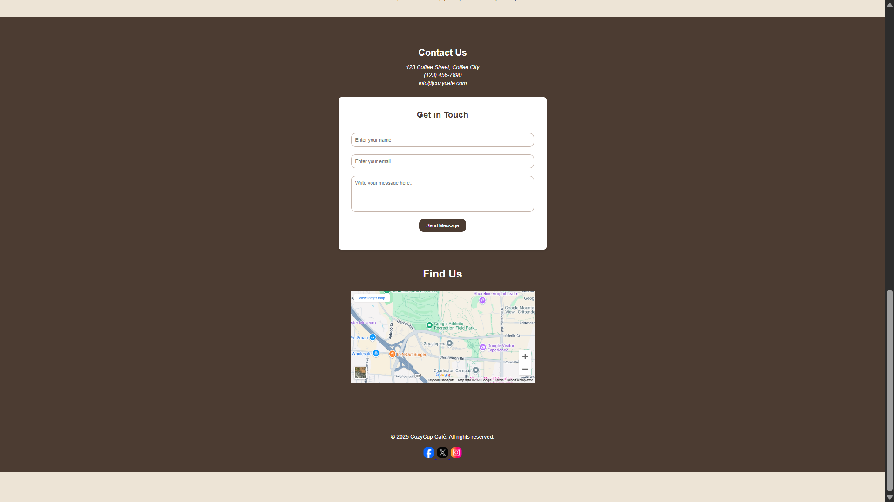

# CozyCup Cafe

## Project Description
CozyCup Cafe is a welcoming and relaxing environment where customers can enjoy freshly brewed coffee and delightful pastries. It offers a serene ambiance perfect for unwinding or working while sipping your favorite beverage.

## Features
- A user-friendly website to explore our menu and services.
- Online ordering and reservation options.
- Dedicated sections for the café’s story and contact details.
- Embedded map for easy location access.
- Contact form for inquiries and feedback.
- Mobile-responsive design.

## Screen Captures
1. **Homepage**  
     
   *The homepage welcomes users with a cozy and inviting design.*

2. **Menu Section**  
     
   *Browse through our wide selection of beverages and pastries.*

3. **About Us Section**  
     
   *Learn about the story and mission of CozyCup Cafe.*

4. **Contact Page**  
     
   *Get in touch with us or find our location on the map.*

## About the Authors
CozyCup Cafe was created by:
- **Theodore Ross Bermejo**  
- **Ivern Bryant Buala**

## Author Details

**Name:** Theodore Ross Bermejo

**Email:** theodoreross18@gmail.com

## Social Links
Connect with us on social media:  

    
    

---

**Name:** Ivern Bryant Buala

**Email:** pavsehfx@gmail.com

## Social Links
Connect with us on social media:  

    
    

